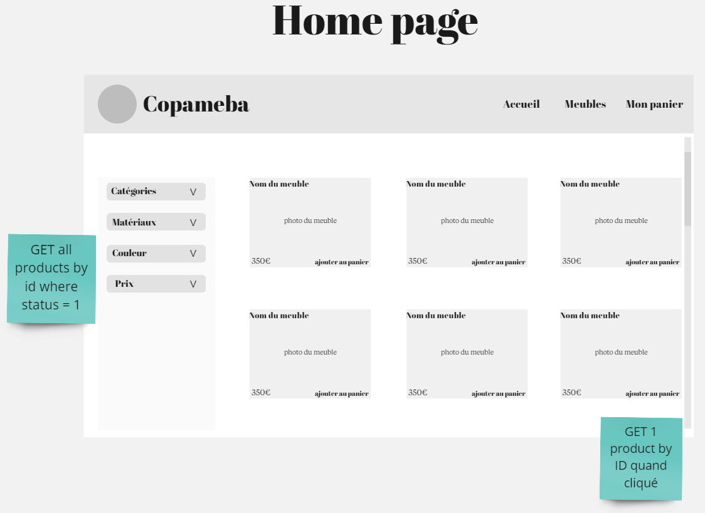
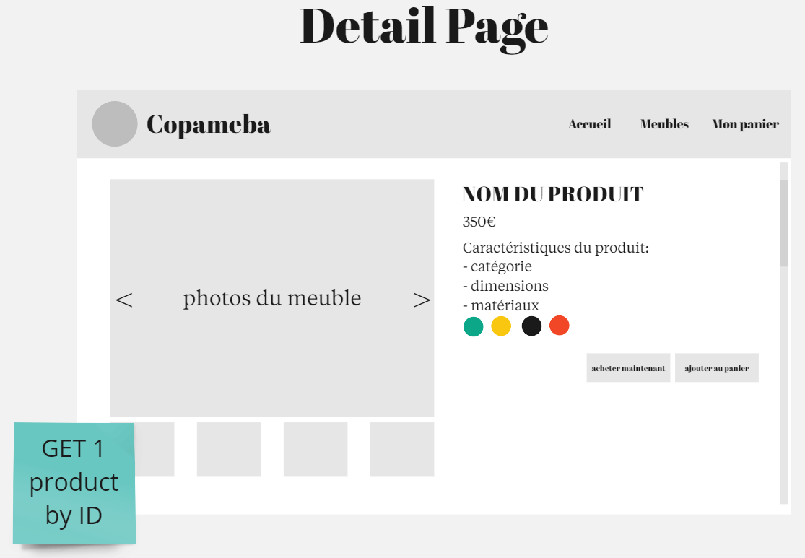
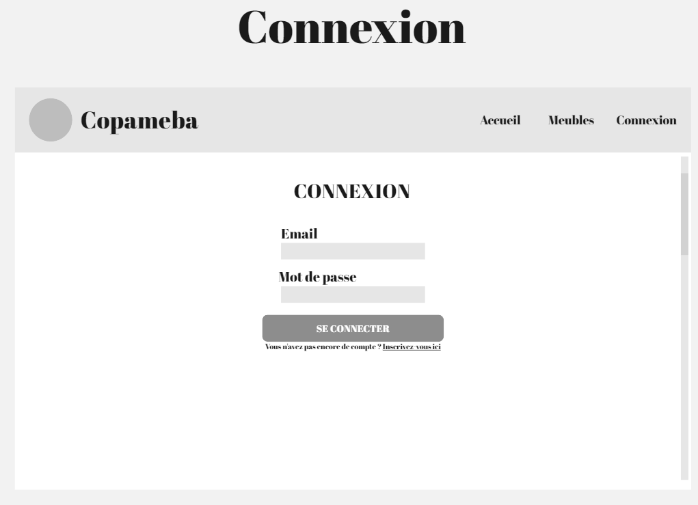
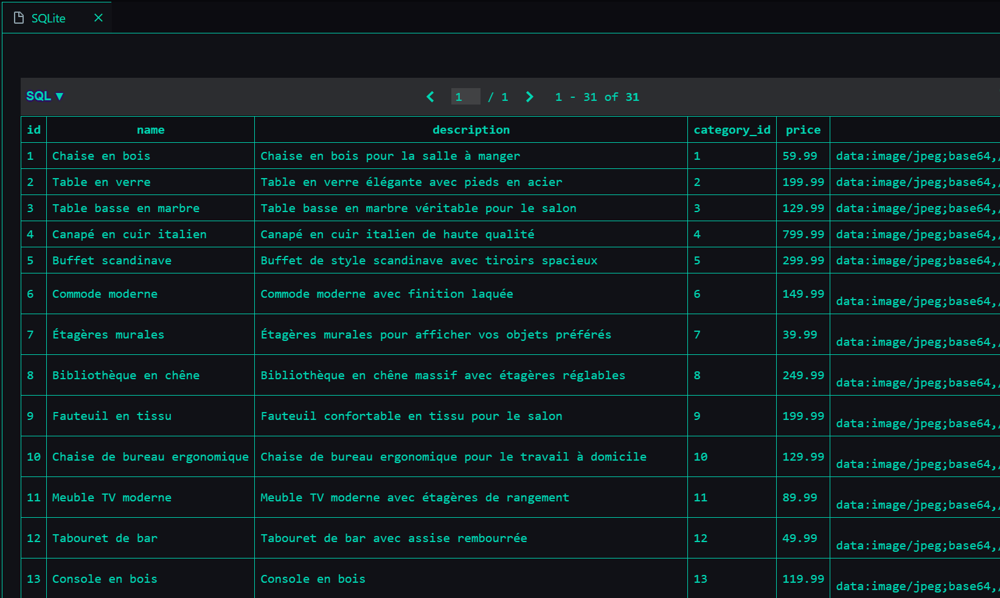
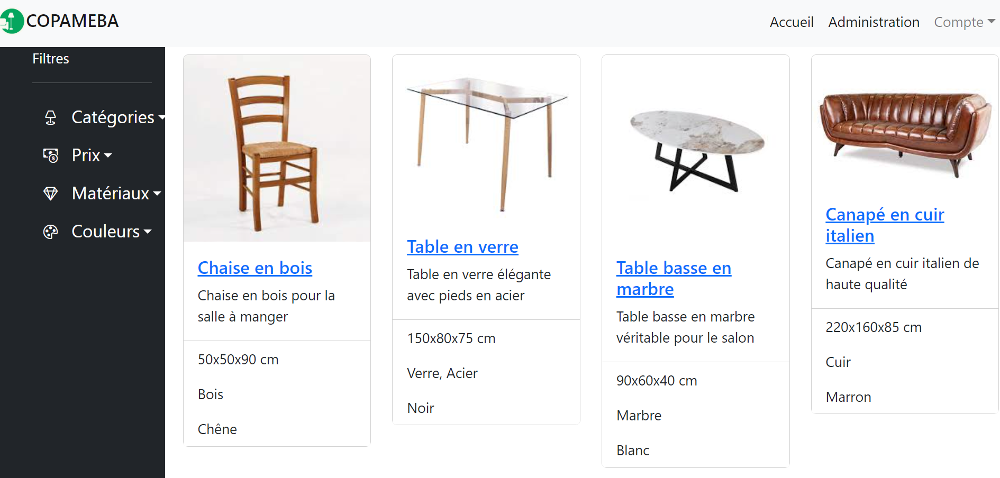
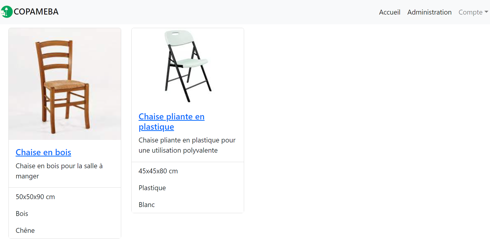
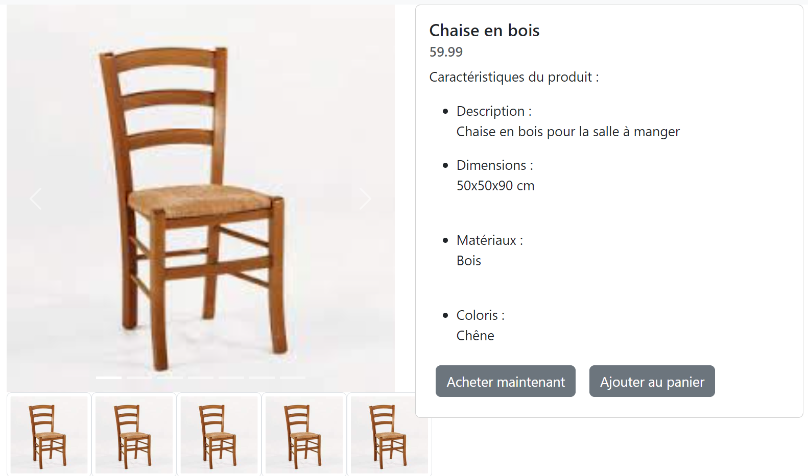
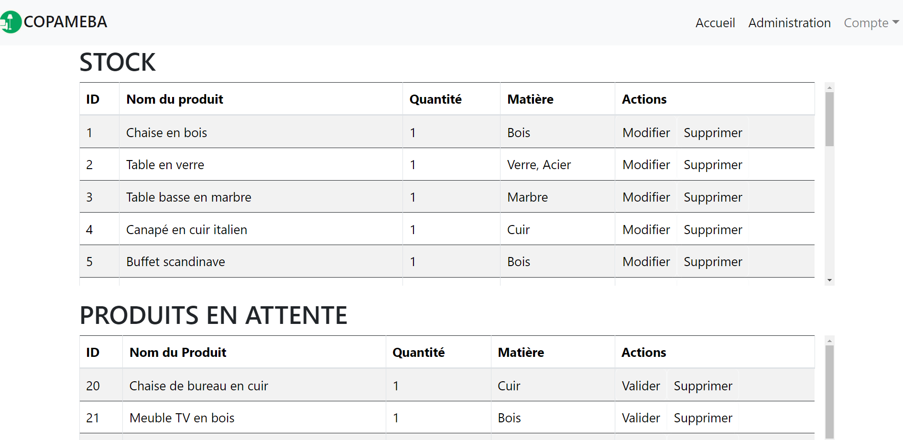
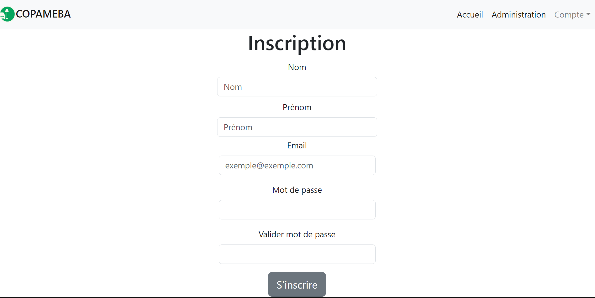

# COPAMEBA 🛋️

## Plateforme de vente de meubles de seconde main

Bienvenue dans notre repository COPAMEBA, un site de vente en ligne de meubles de seconde main, développé dans le cadre d'un projet collectif d'école à Ada Tech School.

### Introduction

COPAMEBA a été conçu et réalisé en deux semaines avec un travail réparti entre 8 apprenant.es (2 équipes de 4, une sur le back-end et l'autre sur le front-end). Ces 2 équipes ont alterné entre les deux stacks à la fin de la première semaine. Le contexte imposé était de répondre aux besoins d'une cliente nommée Lauréline Fleury, qui souhaitait un site web interactif permettant aux utilisateurs de vendre leurs meubles, tout en offrant à la cliente une page d'administration pour gérer le stock des produits.

### Maquette

Avant de commencer le développement, nous avons élaboré une maquette sous forme de wireframe, réalisée sur Miro.









### Organisation

Pour la gestion des tâches nous avons utilisé Trello.


### Back-end & BDD

L'équipe de développement back-end a travaillé avec Node.js et Express pour créer une base solide et sécurisée. Nous avons également utilisé SQLite comme système de gestion de base de données pour stocker les informations sur les meubles, leurs catégories et les utilisateurs.

Technologies utilisées :

- Node.js
- Express
- SQLite
- Axios (pour les requêtes)

Et les tables SQLite sont les suivantes :

- user
- product
- product_category





Voir ce que retournent en méthode GET (avec Insomnia ou Postman) les endpoints suivant :

- http://localhost:8080/products
- http://localhost:8080/products_category

Une fois le repository cloné en local, penser à initialiser le fichier `package.json` et à installer les dépendances avec :

```
npm init -y
npm install // ou npm i
```

Les commandes pour lancer le serveur depuis le dossier my-app :

```
cd my-app
npm run start-dev
```

### Front-end

L'équipe front-end a pris en charge l'interface utilisateur en utilisant React.js et Bootstrap.

Technologies utilisées :

- React.js
- Bootstrap

Les commandes pour démarrer l'application depuis le dossier my-app :

```
cd my-app
npm run start
```

Voici un aperçu des différentes pages :












### Ce qui pourrait être amélioré :

Voici quelques fonctionnalités qui seraient utiles à ajouter :

- La possibilité de partager des événements.
- L'ajout d'un calendrier pour visualiser tous les événements créés par les personnes suivies par le compte de Lauréline, facilitant ainsi le suivi de ces événements.

### Conclusion

COPAMEBA est le fruit de l'effort collaboratif de notre équipe, qui a réussi à réaliser un projet complexe en seulement deux semaines. Nous sommes fiers de ce premier résultat.

### Équipe COPAMEBA :

**Equipe back-end (1ère semaine) :**

- Oriane
- Alexandre
- Bradley
- Alexis

**Equipe front-end (1ère semaine):**

- Clémentine
- Marie
- Eline
- Pierre

Merci de visiter notre repository ! 😃
